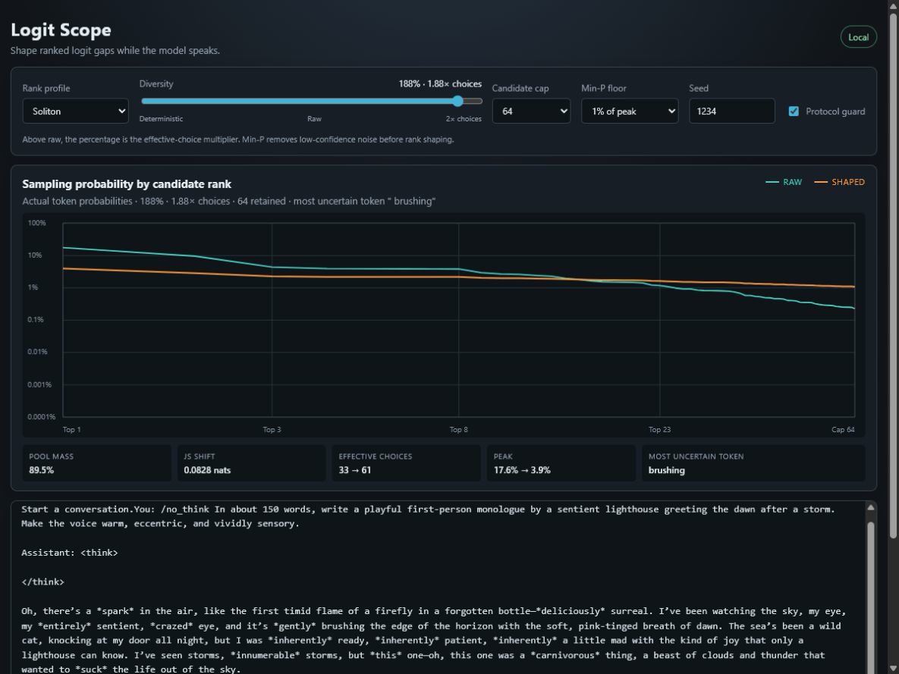
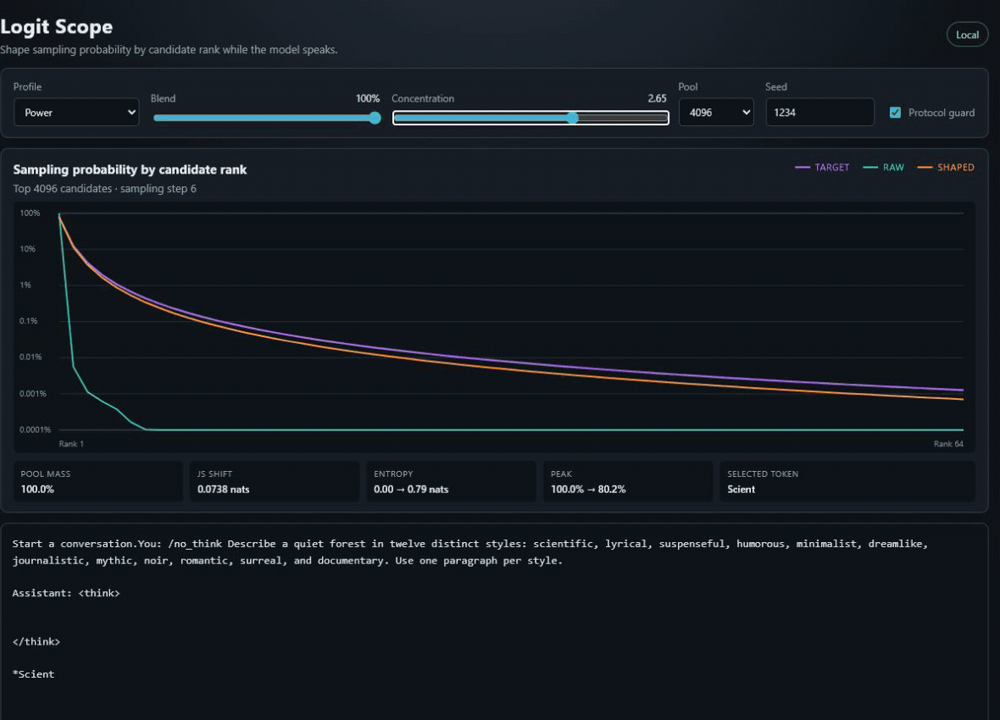

# Logit Scope

Logit Scope is a local chat laboratory for reshaping an LLM's next-token probability distribution in real time. It preserves the model's candidate ranking, then applies a chosen profile to the gaps between adjacent ranked logits while you watch the raw and shaped curves.

Created by [Aaron (`caustik`)](https://github.com/caustik) and released by APU Software, LLC.



The project is a small C++ application built directly on [llama.cpp](https://github.com/ggml-org/llama.cpp). It serves an embedded, dependency-free web interface on localhost. There is no JUCE dependency, package manager, cloud service, or separate frontend build.

## What you can manipulate

- **Profile:** no shaping, or an exponential, soliton, power, or half-normal response across adjacent ranked-logit gaps
- **Diversity:** moves from deterministic sampling at 0%, through unchanged sampling at 100%, to twice the model's effective choices at 200%, subject to the candidate policy and protocol guard
- **Candidate cap:** limits sampling to at most the top 32–4096 candidates
- **Min-P floor:** removes candidates whose raw probability is too small relative to the leading candidate; the default is 1% of the peak
- **Seed:** initializes the random sampler for the next response
- **Protocol guard:** leaves control and end-of-generation logits at their raw values

The default personality is **Soliton** at **188% diversity**, with a **64-candidate cap**, **1% Min-P floor**, seed **1234**, and the protocol guard enabled.

Profile, diversity, candidate-policy, and protocol-guard changes take effect on the next sampled token, including during a response. Seed changes take effect when the next response starts.



## Clone and build

Prerequisites are Git, CMake 3.21 or newer, and a C++17 compiler. Ninja is used by the supplied macOS/Linux presets. On Windows, the preset uses Visual Studio 2022.

```sh
git clone --recurse-submodules https://github.com/caustik/logit-scope.git
cd logit-scope
```

If you already cloned without submodules:

```sh
git submodule update --init --recursive
```

Windows CPU build:

```powershell
cmake --preset windows-cpu-release
cmake --build --preset windows-cpu-release
ctest --preset windows-cpu-release
```

macOS or Linux CPU build:

```sh
cmake --preset unix-cpu-release
cmake --build --preset unix-cpu-release
ctest --preset unix-cpu-release
```

The Windows executable is `build/windows-cpu-release/Release/logit-scope.exe`. The macOS/Linux executable is `build/unix-cpu-release/logit-scope`.

Vulkan and CUDA presets are also provided; list the presets available on your platform with `cmake --list-presets`. A normal llama.cpp GPU toolchain is required for those configurations. macOS uses llama.cpp's Metal backend when available.

## Run

Supply any chat-capable GGUF model whose license permits your use:

```sh
logit-scope --model /path/to/model.gguf
```

The program opens `http://127.0.0.1:8080/` in your browser. It runs entirely on your machine and binds only to localhost by default.

Useful options:

```text
--ctx-size <tokens>   Context capacity (default: 4096)
--max-tokens <count>  Maximum tokens in one response (default: 1024)
--threads <count>     CPU inference threads
--gpu-layers <count>  Layers to offload (use a large value such as 999 for all)
--port <number>       Local HTTP port (default: 8080)
--no-browser          Do not open the browser automatically
```

You can also set `LOGIT_SCOPE_MODEL` instead of passing `--model` each time.

## How shaping works

At each sampling step, Logit Scope sorts finite logits from highest to lowest, applies the Min-P relative-probability floor, and retains at most the configured candidate cap. If the top raw logit is `l(0)`, a candidate survives Min-P threshold `m` when:

```text
exp(l(r) - l(0)) >= m
```

This makes `K` the number of candidates that survived the floor and cap, not necessarily the configured maximum. When the protocol guard is enabled, protected control and end-of-generation tokens inside the candidate cap also survive the floor. A shaped profile supplies a monotonically increasing rank curve `f(r)`. Logit Scope applies the profile to each adjacent raw logit gap `g(r) = l(r - 1) - l(r)`:

```text
exponential:  f(r) = r
soliton:      f(r) = -log(sech²(r)) = 2 log(cosh(r))
power:        f(r) = log(r + 1)
half-normal:  f(r) = r²

w(r) = f(r) - f(r - 1)
sharpen: g'(r) = g(r) + s w(r)
loosen:  g'(r) = g(r) exp(-s w(r))
```

The shaped logits are reconstructed from `l'(0) = l(0)` and those gaps. Positive raw gaps therefore stay positive at every finite loosening strength: shaping cannot make a lower-ranked token overtake a higher-ranked one, and it no longer creates a broad equal-logit plateau as a side effect of clamping. With the **Exponential** profile, `w(r) = 1`, so loosening scales every adjacent gap by the same amount, similar to temperature but calibrated to a directly interpretable entropy target.

The **Soliton** profile takes the descending half of the canonical `sech²` [Korteweg–de Vries solitary-wave pulse](https://gfd.whoi.edu/wp-content/uploads/sites/18/2018/03/NLW1-Intro_52126.pdf) and uses its negative log as a rank penalty. It borrows that envelope as a smooth weighting curve; the sampler does not solve a wave equation. The result has a rounded shoulder across the highest-ranked candidates and approaches exponential suppression in the tail.

The profile strength `s` is not exposed as a control. Instead, the shared calibrator solves for it on every token. Below 100%, diversity scales the raw entropy toward zero. Above 100%, diversity multiplies the distribution's effective number of choices, `exp(H)`, until the selected pool's finite maximum is reached:

```text
0% ≤ diversity ≤ 100%: shaped entropy = D × raw entropy
100% < diversity ≤ 200%: shaped entropy = min(log(K), raw entropy + log(D))
effective choices = exp(entropy)
```

Below 100%, the profile removes probability from lower ranks. Above 100%, it returns probability toward lower ranks while preserving the model's candidate order. For example, 105% requests only 1.05 times the raw effective choices, while 200% requests twice as many. The previous distance-to-uniform interpretation made even a small move above 100% pull in proportion to `log(K)`; with a large fixed pool, that could flatten many implausible tail tokens and sharply destabilize generation. The effective-choice interpretation is independent of unused pool capacity and reaches uniform only when doubling the raw effective choices would already exhaust the selected pool.

This keeps profile experiments small: a new profile supplies one rank curve, while the common bidirectional calibration and UI contract remain unchanged. The **None** profile is an exact shaping bypass, and 100% diversity is also an exact shaping bypass. The Min-P floor and candidate cap are a separate candidate policy and still apply in either bypass mode.

Zero diversity is handled as an explicit boundary rather than asking the numerical calibrator to find infinite strength. The rank shaper assigns zero probability to every candidate below rank one. With **Protocol guard** enabled, protected control and end-of-generation logits are then restored and the surrounding logits are clamped to preserve candidate order, so the result is as deterministic as the guard permits rather than necessarily having exactly zero entropy.

Before generation, the scope shows a clearly labeled illustrative rank curve and runs it through the same C++ shaper as real tokens, so profile, diversity, floor, and cap changes have immediate visual feedback. The preview is not a model prediction and does not include token-specific protocol-guard effects. Its probability axis fits the plotted values over a two- to six-decade range. During generation, actual token probabilities replace the preview and the scope reports retained raw probability mass, Jensen–Shannon shift, effective choices, peak probability, and the selected token. Sampling data is published only after a non-EOG token is selected. While generation is active the curves follow the current decision, but both axes remain stable: probability uses a fixed six-decade range and the `log(1 + r)` rank axis spans the configured candidate cap. Each curve ends at the token's actual Min-P-retained `K`, which is reported in the caption. After completion the scope retains the response's highest-uncertainty decision instead of ending on almost-certain punctuation or EOG. Up to 64 display samples are distributed across the retained candidates rather than truncating the view to the first candidates.

## Project layout

```text
include/logit_scope/   Rank shaping and engine API
src/                   llama.cpp sampler, chat engine, and local HTTP server
web/                   Embedded HTML, CSS, and JavaScript UI
tests/                 Dependency-free rank-profile tests
third_party/llama.cpp  Pinned llama.cpp Git submodule
```

The frontend files are converted to C++ byte arrays during the CMake build and compiled into the executable.

## Current MVP boundaries

- One local user/session and one model per process
- Text-only GGUF chat models
- Context is retained until it fills; use **Clear** to start over
- No model downloader or model redistribution
- No authentication when binding to a non-localhost address; doing so is not recommended on an untrusted network

## Licensing

The original Logit Scope source code is licensed under the [Apache License 2.0](LICENSE), with copyright held by APU Software, LLC. Creator attribution is recorded in [NOTICE](NOTICE) and [CITATION.cff](CITATION.cff).

llama.cpp and the libraries vendored within its submodule retain their own licenses; see [THIRD_PARTY_NOTICES.md](THIRD_PARTY_NOTICES.md). GGUF model weights are not included and may have separate terms.
