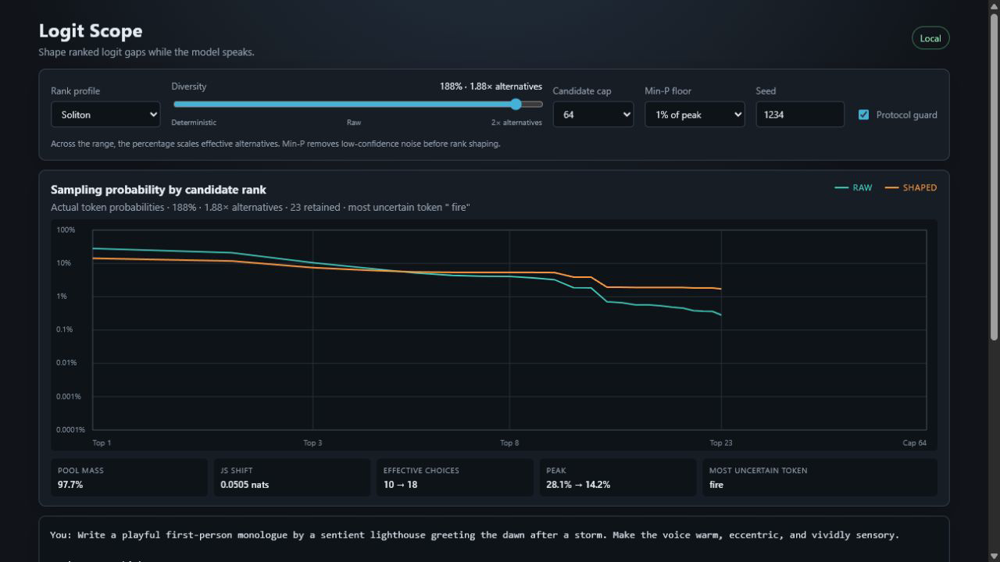
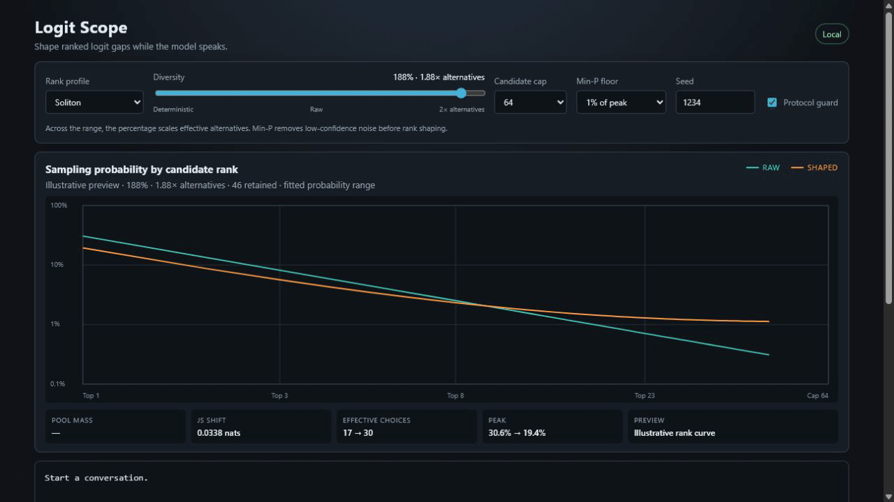

# Logit Scope

Logit Scope is a local chat laboratory for reshaping an LLM's next-token probability distribution in real time. It preserves the model's candidate ranking, then applies a chosen profile to the gaps between adjacent ranked logits while you watch the raw and shaped curves.

Created by [Aaron (`caustik`)](https://github.com/caustik) and released by APU Software, LLC.



The project is a small C++ application built directly on [llama.cpp](https://github.com/ggml-org/llama.cpp). It serves an embedded, dependency-free web interface on localhost. There is no JUCE dependency, package manager, cloud service, or separate frontend build.

## What you can manipulate

- **Profile:** no shaping, a slope-preserving temperature baseline, or an exponential, soliton, power, or half-normal response across adjacent ranked-logit gaps
- **Diversity:** scales the model's effective alternatives from none at 0%, through unchanged sampling at 100%, to twice as many at 200%, subject to the candidate policy and protocol guard
- **Candidate cap:** limits sampling to at most the top 32–4096 candidates
- **Min-P floor:** removes candidates whose raw probability is too small relative to the leading candidate; the default is 1% of the peak
- **Seed:** initializes the random sampler for the next response
- **Protocol guard:** leaves control and end-of-generation logits at their raw values

The default personality is **Soliton** at **188% diversity**, with a **64-candidate cap**, **1% Min-P floor**, seed **1234**, and the protocol guard enabled.

Profile, diversity, candidate-policy, and protocol-guard changes take effect on the next sampled token, including during a response. Seed changes take effect when the next response starts.



## Blind evaluation lab

The **Blind settings comparison** panel turns a settings impression into a repeatable paired experiment:

1. Define configurations A and B. The supplied starting comparison holds the candidate policy constant and compares the raw bypass against the default Soliton personality.
2. Add several prompts and choose repeats. Every pair uses the same prompt and seed in two isolated one-turn conversations; the normal chat and controls are restored after each response.
3. Generate the pairs. Response placement is randomized, generation order is randomized, and configuration identities stay concealed while judging.
4. Score both responses from 1–5 for task fit, coherence, and style/usefulness, then choose left, tie, or right. Settings and diagnostics reveal only after the judgment is saved.
5. Read the aggregate preference score, win/tie/loss counts, mean rubric ratings, word counts, repeated-trigram rates, and two-sided exact sign-test result. Export the full experiment as JSON or CSV for outside analysis.

Blind pairwise comparison reduces expectation and position effects; position bias is a documented concern in LLM evaluation, including [MT-Bench and Chatbot Arena](https://arxiv.org/abs/2306.05685). Paired prompts and seeds reduce nuisance variation, while multiple task types test whether a setting generalizes beyond one appealing sample.

The lab produces better evidence, not an automatic definition of quality. A single evaluator is still expressing preferences, a low repetition rate does not prove a good response, and a sign-test p-value measures consistency of the recorded choices rather than practical importance. Use varied prompts, inspect rubric dimensions rather than only overall wins, and collect at least 10 non-tied decisions before treating the result as more than exploratory. Experiments remain in browser-local storage until exported or deleted.

## Distribution Lab

The **Distribution Lab** measures whether sampler profiles allocate probability mass accurately on finite tasks with known answer distributions. Its default comparison holds candidate support fixed and evaluates entropy-matched **Temperature** and **Soliton** configurations from the same next-token logits.

Built-in tasks cover the sum and maximum of two fair dice, the number of heads in four fair tosses, the first-head position in three tosses, and an explicit-probability pipeline control. A run works as follows:

1. Choose a task, sampler settings, balanced-block count, preferred assistant prefix, projected-draw count, and seed. Distribution Lab defaults Min-P to off so valid answer labels are not removed before profile shaping.
2. For each mapping, the interface assigns every semantic outcome an opaque uppercase label and rotates both label assignments and display positions. One balanced block gives every outcome every label and every position exactly once.
3. The engine formats the prompt, validates every label as exactly one distinct token in that precise tokenizer context, and automatically selects a compatible boundary when the preferred assistant prefix would retokenize a label. This can move trailing whitespace from the decoded context into each label token, which lets tokenizers use their natural leading-space label tokens without changing the labels shown in the experiment. The resolved context prefix and label-token prefix are recorded with the result. The selected prompt is then decoded once to read the complete next-token logits.
4. Every requested configuration transforms an independent copy of those same logits through the normal candidate cap, Min-P, rank-profile, and protocol-guard implementation.
5. Results are converted from label space back to semantic outcomes and aggregated as both pooled scores and mean per-mapping scores. Mapping sensitivity shows when balanced averaging hides unstable individual prompts.

The lab reports three probability stages:

- **Full raw** is the model softmax over every finite vocabulary logit before filtering or shaping.
- **Retained raw** is the normalized distribution after candidate-cap and Min-P support selection but before profile shaping.
- **Shaped** is the final normalized distribution after the selected rank profile and protocol guard.

Open-set metrics include probability assigned to every invalid token, while label-conditional metrics renormalize only the valid labels to isolate relative weighting from response-protocol failure. Total variation and normalized Jensen–Shannon distance are the primary distribution errors; valid/invalid mass, missing target mass, entropy error, pairwise order accuracy, top invalid tokens, and mapping sensitivity explain why a score changed.

The **Projected draws** counts are deterministic categorical samples from the exact shaped probability vector. They make expected repeated behavior intuitive and verify the categorical sampler, but they are not repeated model decodes and are never the source of the score. Version 1 intentionally supports built-in finite tasks, one generated token, and context-validated one-token labels only. Automatic boundary selection tries the preferred prefix first and then a small set of explicit token boundaries; a tokenizer that cannot represent enough distinct labels in any supported context fails the probe clearly instead of producing misleading sequence probabilities. Automatic selection can be disabled in the advanced controls when an exact prompt protocol is required.

Runs are saved separately from Blind Lab experiments in browser-local storage. A stopped or browser-interrupted run can resume from its next incomplete mapping. JSON export preserves every raw probe and its formatted prompt; long-form CSV repeats stage, mapping, semantic outcome, token, resolved boundary, exact probability, projected count, sampler diagnostics, and pooled metrics for analysis.

## Clone and build

Prerequisites are Git, CMake 3.21 or newer, and a C++17 compiler. Ninja is used by the supplied macOS/Linux presets. On Windows, the preset uses Visual Studio 2022.

```sh
git clone --recurse-submodules https://github.com/caustik/logit-scope.git
cd logit-scope
```

If you already cloned without submodules:

```sh
git submodule update --init --recursive
```

Windows CPU build:

```powershell
cmake --preset windows-cpu-release
cmake --build --preset windows-cpu-release
ctest --preset windows-cpu-release
```

macOS or Linux CPU build:

```sh
cmake --preset unix-cpu-release
cmake --build --preset unix-cpu-release
ctest --preset unix-cpu-release
```

The Windows executable is `build/windows-cpu-release/Release/logit-scope.exe`. The macOS/Linux executable is `build/unix-cpu-release/logit-scope`.

Vulkan and CUDA presets are also provided; list the presets available on your platform with `cmake --list-presets`. A normal llama.cpp GPU toolchain is required for those configurations. macOS uses llama.cpp's Metal backend when available.

## Run

Supply any chat-capable GGUF model whose license permits your use:

```sh
logit-scope --model /path/to/model.gguf
```

The program opens `http://127.0.0.1:8080/` in your browser. It runs entirely on your machine and binds only to localhost by default.

Useful options:

```text
--ctx-size <tokens>   Context capacity (default: 4096)
--max-tokens <count>  Maximum tokens in one response (default: 1024)
--threads <count>     CPU inference threads
--gpu-layers <count>  Layers to offload (use a large value such as 999 for all)
--port <number>       Local HTTP port (default: 8080)
--no-browser          Do not open the browser automatically
```

You can also set `LOGIT_SCOPE_MODEL` instead of passing `--model` each time.

## How shaping works

At each sampling step, Logit Scope sorts finite logits from highest to lowest, applies the Min-P relative-probability floor, and retains at most the configured candidate cap. If the top raw logit is `l(0)`, a candidate survives Min-P threshold `m` when:

```text
exp(l(r) - l(0)) >= m
```

This makes `K` the number of candidates that survived the floor and cap, not necessarily the configured maximum. When the protocol guard is enabled, protected control and end-of-generation tokens inside the candidate cap also survive the floor. A shaped profile supplies a monotonically increasing rank curve `f(r)`. Logit Scope applies the profile to each adjacent raw logit gap `g(r) = l(r - 1) - l(r)`:

```text
exponential:  f(r) = r
soliton:      f(r) = -log(sech²(r)) = 2 log(cosh(r))
power:        f(r) = log(r + 1)
half-normal:  f(r) = r²

w(r) = f(r) - f(r - 1)
sharpen: g'(r) = g(r) + s w(r)
loosen:  g'(r) = g(r) exp(-s w(r) / g(r))
```

The loosen formula applies when `g(r) > 0`; an existing zero gap remains zero. It is a rank-safe soft version of subtracting `s w(r)`: near zero strength its first-order response is `g(r) - s w(r)`, matching sharpening in the opposite direction, while every positive gap stays positive at finite strength. Large raw-logit cliffs soften later than clusters of close alternatives, and a distribution already in the selected profile family stays in that family as its concentration changes. The shaped logits are reconstructed from `l'(0) = l(0)`, so a lower-ranked token cannot overtake a higher-ranked one.

The **Temperature** baseline instead multiplies every raw gap by the same calibrated factor. It is the familiar slope-preserving logit-temperature transform and provides a control for determining whether a rank profile adds value beyond entropy-matched temperature.

The **Soliton** profile takes the descending half of the canonical `sech²` [Korteweg–de Vries solitary-wave pulse](https://gfd.whoi.edu/wp-content/uploads/sites/18/2018/03/NLW1-Intro_52126.pdf) and uses its negative log as a rank penalty. It borrows that envelope as a smooth weighting curve; the sampler does not solve a wave equation. The result has a rounded shoulder across the highest-ranked candidates and approaches exponential suppression in the tail.

The profile strength `s` is not exposed as a control. Instead, the shared calibrator solves for it on every token. Diversity operates on effective alternatives: the entropy-derived effective choice count minus the one leading choice that is present even in a deterministic distribution.

```text
raw effective choices = exp(H)
raw effective alternatives = exp(H) - 1
target effective choices = min(K, 1 + D × (exp(H) - 1))
target entropy = log(target effective choices)
```

Below 100%, the profile removes probability from lower ranks. Above 100%, it returns probability toward lower ranks while preserving the model's candidate order. Scaling alternatives instead of total choices keeps low-entropy decisions stable: a nearly certain token does not gain a whole fabricated alternative merely because diversity is above 100%. At higher raw entropy the interpretation approaches an ordinary choice multiplier; 200% produces `2 exp(H) - 1` effective choices unless the selected pool is exhausted. The mapping is continuous through the raw distribution and independent of unused pool capacity.

This keeps profile experiments small: a new profile supplies one rank curve, while the common bidirectional calibration and UI contract remain unchanged. The **None** profile is an exact shaping bypass, and 100% diversity is also an exact shaping bypass. The Min-P floor and candidate cap are a separate candidate policy and still apply in either bypass mode.

Zero diversity is handled as an explicit boundary rather than asking the numerical calibrator to find infinite strength. The rank shaper assigns zero probability to every candidate below rank one. With **Protocol guard** enabled, protected control and end-of-generation logits are then restored and the surrounding logits are clamped to preserve candidate order, so the result is as deterministic as the guard permits rather than necessarily having exactly zero entropy.

Before generation, the scope shows a clearly labeled illustrative rank curve and runs it through the same C++ shaper as real tokens, so profile, diversity, floor, and cap changes have immediate visual feedback. The preview is not a model prediction and does not include token-specific protocol-guard effects. Its probability axis fits the plotted values over a two- to six-decade range. During generation, actual token probabilities replace the preview and the scope reports retained raw probability mass, Jensen–Shannon shift, effective choices, peak probability, and the selected token. Sampling data is published only after a non-EOG token is selected. While generation is active the curves follow the current decision, but both axes remain stable: probability uses a fixed six-decade range and the `log(1 + r)` rank axis spans the configured candidate cap. Each curve ends at the token's actual Min-P-retained `K`, which is reported in the caption. After completion the scope retains the response's highest-uncertainty decision instead of ending on almost-certain punctuation or EOG. Up to 64 display samples are distributed across the retained candidates rather than truncating the view to the first candidates.

## Project layout

```text
include/logit_scope/   Rank shaping and engine API
src/                   llama.cpp sampler, chat engine, and local HTTP server
web/                   Embedded HTML, CSS, and JavaScript UI
tests/                 Dependency-free rank-profile and distribution-metric tests
third_party/llama.cpp  Pinned llama.cpp Git submodule
```

The frontend files are converted to C++ byte arrays during the CMake build and compiled into the executable.

## Current MVP boundaries

- One local user/session and one model per process
- Text-only GGUF chat models
- Context is retained until it fills; use **Clear** to start over
- No model downloader or model redistribution
- No authentication when binding to a non-localhost address; doing so is not recommended on an untrusted network

## Licensing

The original Logit Scope source code is licensed under the [Apache License 2.0](LICENSE), with copyright held by APU Software, LLC. Creator attribution is recorded in [NOTICE](NOTICE) and [CITATION.cff](CITATION.cff).

llama.cpp and the libraries vendored within its submodule retain their own licenses; see [THIRD_PARTY_NOTICES.md](THIRD_PARTY_NOTICES.md). GGUF model weights are not included and may have separate terms.
